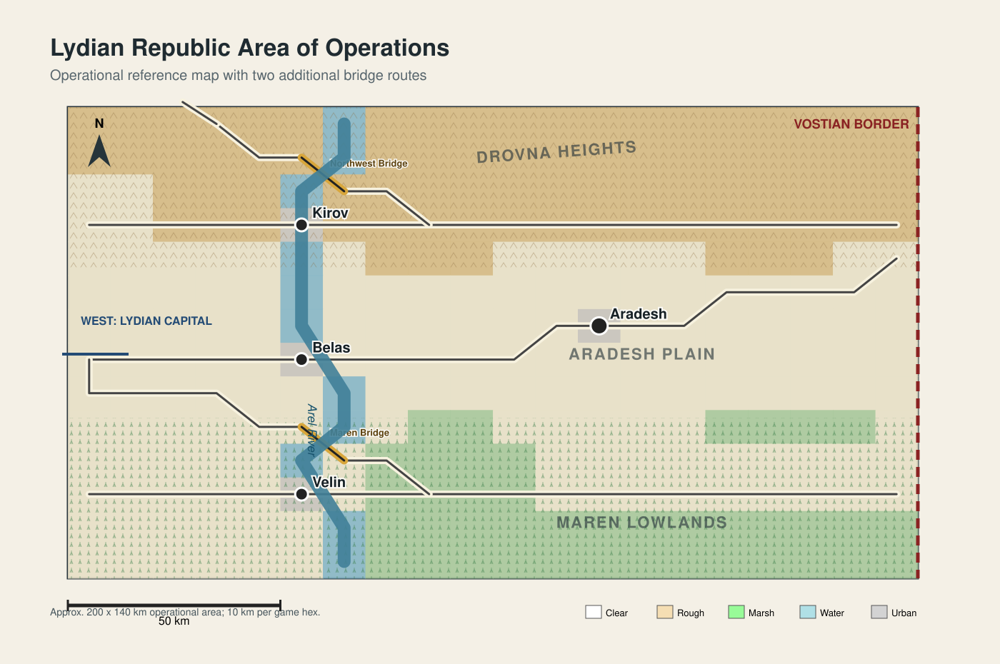

# Defense of the Lydian Republic

> **Scenario status:** Entirely fictional. All countries, political events, military organizations, and geographic locations in this scenario are invented for research and educational use.

This directory contains the complete authored package for **Defense of the Lydian Republic**, an operational-level Atlatl scenario depicting a multinational corps defense against a larger Vostian field army.



## Quick Start

From the repository root, launch the scenario by its stable alias:

```bash
python main.py lydian-republic
```

The scenario can also be launched directly from its package path:

```bash
python main.py scenarios/Lydian_Republic/game/defense_of_the_lydian_republic.scn
```

The `.scn` file does not need to be copied into `server/scenarios/`. Blue repositions first, Red repositions second, and regular play begins with Blue.

The `.scn` file contains everything required for normal play. The standalone map and order-of-battle files are authoring sources for editing and variant creation.

## Scenario Overview

Play begins on **18 May 2030 at 0600 local time (H+48)**. The RDC Coalition Land Corps must defend widely separated objectives with less combat power, while the Vostian 3rd Field Army must turn its temporary advantage in mass and readiness into a rapid decision.

| Element | Baseline |
| --- | --- |
| Blue | RDC Coalition Land Corps; 9 counters |
| Red | Vostian 3rd Field Army; 12 counters |
| Duration | 20 complete Blue/Red turns; 10 days |
| Playable-unit scale | Maneuver brigades and artillery groups |
| Scored objectives | Kirov, Belas, Velin, and Aradesh |
| Unit information | Open; fog of war disabled |
| Status | Complete playable baseline; balance validation pending |

## Documentation Guide

| Document | Use it for |
| --- | --- |
| [Scenario specification](scenario.md) | Design intent, scope, forces, abstractions, and development status. |
| [Road to war](road_to_war_defense_of_the_lydian_republic.md) | Political background, escalation, and the H+48 invasion chronology. |
| [Game-file guide](game/README.md) | Authoritative runtime configuration, setup, scoring, deployment, and game-file maintenance. |
| [Order of battle](game/order_of_battle.md) | Formation strengths, roles, and command relationships. |
| [Map guide](map/README.md) | Authoritative map contents, geography, editing, and synchronization workflow. |
| [Operations-order index](operations_orders/README.md) | Controller-facing index of both sides' briefing hierarchies, support orders, graphics, and disclosure guidance. |

## Player Briefings

For opposed play, Blue and Red operations orders and operational graphics are **side-specific**. Each player should normally use only their assigned side's link below unless the group agrees to open plans; the full operations-order index identifies both sides' plans. The scenario specification, road to war, order of battle, map products, game configuration, and unit information are shared.

| Side | Start here |
| --- | --- |
| Blue | [RDC Coalition Land Corps order](operations_orders/Blue/B-00_rdc_coalition_land_corps_opord.md) |
| Red | [Vostian 3rd Field Army order](operations_orders/Red/R-00_vostian_3rd_field_army_opord.md) |

Controllers and scenario administrators can use the [operations-order index](operations_orders/README.md) to reach the complete order hierarchy and both sets of graphics.

## Authoring Boundaries

| Source | Owns |
| --- | --- |
| [`defense_of_the_lydian_republic.scn`](game/defense_of_the_lydian_republic.scn) | Playable runtime state, including units, starting positions, setup zones, ownership, duration, and scoring. |
| [`lydian_republic_ao.map.json`](map/lydian_republic_ao.map.json) | Canonical hex geometry, terrain, roads, rivers, and geographic features. |
| [`oob.json`](game/oob.json) | Reusable placement OOB with intentionally unset locations. |
| [Written orders](operations_orders/README.md) | Player-enforced command relationships, phases, priorities, control measures, and reporting requirements. |

When geography changes, synchronize it from the map source into the completed scenario without overwriting scenario-specific runtime state. Detailed procedures belong in the [map](map/README.md) and [game-file](game/README.md) guides.
