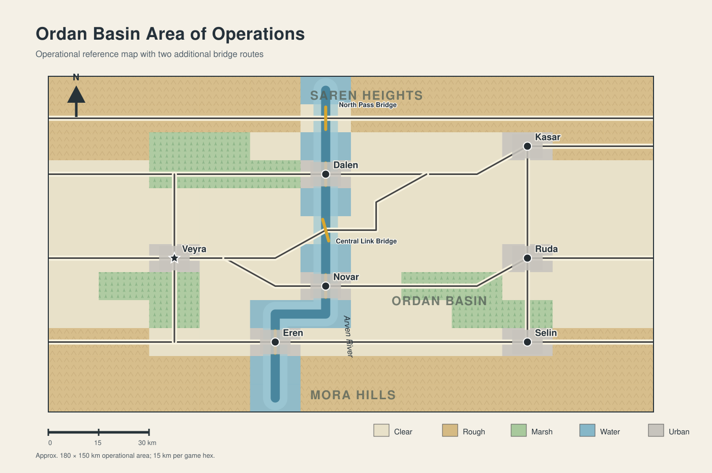

# The Race for the Ordan Basin

> **Scenario status:** Entirely fictional. All countries, political events, military organizations, and geographic locations in this scenario are invented for research and educational use.

This directory contains the complete authored package for **The Race for the Ordan Basin**, an operational-level Atlatl scenario depicting competing Western Compact and Karsovian interventions during an Ordan constitutional crisis.

This README is also the public player and optional-controller quick reference for baseline play.



## Quick Start

From the repository root, launch the scenario by its stable alias:

```bash
python main.py ordan-basin
```

The scenario can also be launched directly from its package path:

```bash
python main.py scenarios/Ordan_Basin/game/race_for_the_ordan_basin.scn
```

The `.scn` file does not need to be copied into `server/scenarios/`. Blue repositions first, Red repositions second, and regular play begins with Blue.

The `.scn` file contains everything required for normal play. The standalone map and order-of-battle files are authoring sources for editing and variant creation.

## Scenario Overview

Play begins on **12 September 2031 at 0600 local time**. The Western Compact–Ordan Joint Land Corps and Karsovian Eastern Army enter from opposite map edges and race for seven initially neutral cities, five Arven River crossings, and the basin's transportation network.

| Element | Baseline |
| --- | --- |
| Blue | Western Compact–Ordan Joint Land Corps; 13 counters; 1,210 current strength |
| Red | Karsovian Eastern Army; 13 counters; 1,300 current strength |
| Duration | 18 complete Blue/Red turns; 36 player phases; 9 days |
| Playable-unit scale | Maneuver brigades and artillery groups |
| Scored objectives | Veyra, Dalen, Novar, Eren, Kasar, Ruda, and Selin |
| Initial city ownership | Neutral for all seven cities |
| Unit information | Open; fog of war disabled |
| Default deployment | All playable units outside cities in opposing edge setup zones |
| Status | Complete playable baseline; balance validation pending |

## Documentation Guide

| Document | Use it for |
| --- | --- |
| [Scenario specification](ordan_basin_scenario.md) | Design intent, scope, forces, abstractions, runtime rules, and development status. |
| [Road to war](road_to_war_race_for_the_ordan_basin.md) | Political background, escalation, and the transition to the 12 September meeting engagement. |
| [Game-file guide](game/README.md) | Authoritative runtime configuration, setup, scoring, deployment, and game-file maintenance. |
| [Order of battle](game/order_of_battle.md) | Formation strengths, roles, command relationships, and represented capabilities. |
| [Map guide](map/README.md) | Authoritative map contents, geography, editing, and synchronization workflow. |
| [Operations-order index](operations_orders/README.md) | Side-specific index of both briefing hierarchies, master crosswalks, support orders, graphics, and disclosure guidance. |

## Player and Optional Controller Reference

> **Controller-free baseline:** Both players may read this section. A controller may facilitate play under procedures agreed before setup but is not required.

### Before Play and Disclosure

Use closed plans unless both players agree otherwise. The scenario specification, road to war, order of battle, maps, game guide, and engine-visible unit information are shared. Each side's orders, master crosswalk, and operational graphics are private to that side. Open unit information does not make the opposing plan open.

Read the [road to war](road_to_war_race_for_the_ordan_basin.md), [order of battle](game/order_of_battle.md), and [reference map](map/ordan_basin_ao_reference.png), then open only the assigned side's products:

| Side | Senior order | Synchronization aid | Graphics |
| --- | --- | --- | --- |
| Blue | [Western Compact–Ordan Joint Land Corps order](operations_orders/Blue/B-00_wco_joint_land_corps_opord.md) | [Blue master crosswalk](operations_orders/Blue/blue_master_synchronization_crosswalk.md) | [Blue graphics](operations_orders/Blue/Blue_operational_graphics.pdf) |
| Red | [Karsovian Eastern Army order](operations_orders/Red/R-00_karsovian_eastern_army_opord.md) | [Red master crosswalk](operations_orders/Red/red_master_synchronization_crosswalk.md) | [Red graphics](operations_orders/Red/Red_operational_graphics.pdf) |

If using a controller or special adjudication, agree on the controller's authority and any unmodeled effects before setup. The [operations-order index](operations_orders/README.md) provides the complete order hierarchy and disclosure guidance.

### Setup Checklist

1. Blue may reposition all thirteen units on eligible non-water hexes in columns `x=0–1`.
2. After Blue ends setup, Red may reposition all thirteen units on eligible non-water hexes in columns `x=10–11`.
3. Keep every unit outside the seven urban hexes, within its permitted zone, and unstacked. Default positions are legal suggestions rather than mandatory dispositions.
4. Red may adjust after observing Blue's entry disposition. Open unit information is intentional.
5. Setup phases do not count toward the 36 regular player phases and award no city points. All seven cities begin neutral, and regular play begins with Blue.

### Objectives, Scoring, and End Conditions

| Objective | Hex | Value each regular player phase |
| --- | --- | --- |
| Kasar | `hex-9-2` | 10 points |
| Dalen | `hex-5-3` | 10 points |
| Veyra | `hex-2-6` | 10 points |
| Novar | `hex-5-7` | 10 points |
| Ruda | `hex-9-6` | 10 points |
| Eren | `hex-4-9` | 10 points |
| Selin | `hex-9-9` | 10 points |

At the end of each regular player phase, an occupied city changes to the occupier's faction; an empty city retains its owner. Blue control adds points, Red control subtracts them, and neutral ownership awards nothing. Each Blue strength point lost subtracts one point; each Red strength point lost adds one point. A unit reduced below 50 percent strength is removed, and its remaining strength is counted as lost. Play ends after 36 regular player phases even if one side has lost all units. The engine reports a raw score from Blue's perspective but applies no validated victory bands.

### Engine and Player Responsibilities

| Enforced by Atlatl | Enforced by players |
| --- | --- |
| Map and unit state; movement and combat procedures; city ownership; player-phase count; raw scoring | Command relationships; reserve-release authority; Operational Phases; main-effort and fires-priority changes; boundaries and control measures; handoffs; weather and political guidance; reporting requirements |

- A player phase is one side's engine activation. A capitalized **Operational Phase** is a stage of the written plan. Blue phases are conditions-based; Red turn windows are projections. Neither changes automatically with the engine phase counter.
- In controller-free play, the player or team controlling the proper headquarters records phase transitions, reserve commitments, handoffs, and accepted risks. No controller approval is required.
- Do not abandon a city, crossing, route, seam, guard, or retain responsibility until the receiving formation accepts the handoff or the proper headquarters records the risk.
- North Pass, Central Link, continuous routes, reserve posture, and political end states matter operationally but are not separately scored by the engine.
- Operational graphics are planning products. Translate their control measures into map hexes; they are not an engine overlay.
- Do not invent combat modifiers for weather, visibility, logistics, intelligence, legitimacy, or other unmodeled capabilities unless both players agreed to an adjudication method before setup.

### Optional Controller and End-of-Game Checklist

- Protect closed-plan information and confirm legal, city-free setup without advising either side.
- Record consequential phase changes, reserve commitments, passages, handoffs, accepted risks, and rulings.
- Apply the same interpretation to both sides. Resolve conflicts using the signed orders and their stated precedence; do not become an additional commander.
- Add no reinforcements, capabilities, modifiers, or injects unless authorized by the agreed scenario procedure.
- At completion, players or the optional controller record the final raw score, city ownership, strength losses, reserve status, narrative objectives, major handoffs, and unresolved order conflicts.

## Authoring Boundaries

| Source | Owns |
| --- | --- |
| [`race_for_the_ordan_basin.scn`](game/race_for_the_ordan_basin.scn) | Playable runtime state, including units, default positions, setup sequence, ownership, duration, and scoring. |
| [`ordan_basin_ao.map.json`](map/ordan_basin_ao.map.json) | Canonical hex geometry, terrain, roads, river representation, setup zones, and open-information flag. |
| [`oob.json`](game/oob.json) | Reusable 26-counter placement OOB with intentionally unset locations. |
| [Written orders](operations_orders/README.md) | Player-enforced command relationships, phases, priorities, control measures, and reporting requirements. |

When geography changes, synchronize it from the map source into the completed scenario without overwriting scenario-specific runtime state. Detailed procedures belong in the [map](map/README.md) and [game-file](game/README.md) guides.
